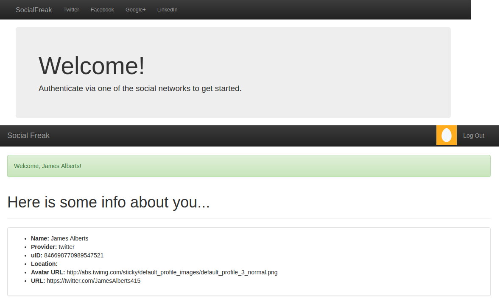

# Social Freak

SoicalFreak is a simple app allowing users to authenticate via one of the presented social networks(Facebook, Twitter, Google+, Linkedin).

  

## Install

* Install Ruby -v 2.4.1 and Rails -5.0.1
* bundle install
* rake db:create db:migrate db:schema:load db:seed
* rails server

## Authentication Via Twitter

* Navigate to apps.twitter.com
* Click “Create new app”
* Fill in the form. For the callback URL, provide your site’s address plus “/auth/twitter/callback”. If you are on a local machine, provide 
(http://localhost:3000/auth/twitter/callback). We will discuss this callback URL shortly.
* Click “Create”.
* You will be redirected to the app’s information page on Twitter. Navigate   to the “Keys and Access Tokens” tab.
* Copy the Consumer Key and Consumer Secret and paste them into the initializer file.
* Please note that you may further set up this strategy as described [here](https://github.com/arunagw/omniauth-twitter#authentication-options). 

## Authentication Via Facebook

* Navigate to developers.facebook.com.
* Click “Add new app” under “My Apps” menu item.
* Click “Website” in the dialog.
* Click “Skip and Create ID”.
* Enter a name for your app and choose a category, click “Create”.
* You will be redirected to the app’s page. Click “Show” next to the “App Secret” and enter your password to reveal the key. Copy and paste     those keys into your initializer file.
* Open “Settings” section.
* Click “Add Platform” and choose “Website”.
* Fill in “Site URL” (http://localhost:3000 for local machine) and “App Domains” (must be derived from the Site URL or Mobile Site URL).
* Fill in “Contact E-mail” (it is required to make app active) and click “Save Changes”
* Navigate to the “Status & Review” section and set the “Do you want to make this app and all its live features available to the general        public?” switch to “Yes”.    
* Please note that you may further set up this strategy as described [here](https://github.com/mkdynamic/omniauth-facebook#configuring).

## Authentication Via Google+

* Navigate to console.developers.google.com.
* Click “Create Project” and give it a name.
* Open “APIs” section from the right-side menu and make sure Google+ API is enabled.
* Open “Consent Screen” and fill in “Product Name” (and other fields if you wish).
* Open “Credentials” and click “Create new Client ID”.
* Choose “Web Application”.
* Enter your app’s URL in the “Authorized JavaScript origins” (http://localhost:3000 for local machine).
* Enter your app’s URL plus “/auth/google_oauth2/callback” in “Authorized redirect URIs”.
* Please note that you may further set up this strategy as described [here](https://github.com/zquestz/omniauth-google-oauth2#configuration).

## Authentication Via Linkedin

* Navigate to linkedin.com/secure/developer.
* Click “Add new application”.
* Fill in the required fields. This form is much bigger (and a bit buggy) than you’ve seen when registering apps for other social networks, so be patient.
* Fill in “OAuth 2.0 Redirect URLs” with a URL in the format “/auth/linkedin/callback”.
* After submitting the form, open your app’s page and copy Consumer key and Consumer secret into your initializer file.
* Please note that you may further set up this strategy as described [here](https://github.com/decioferreira/omniauth-linkedin-oauth2#profile-fields).